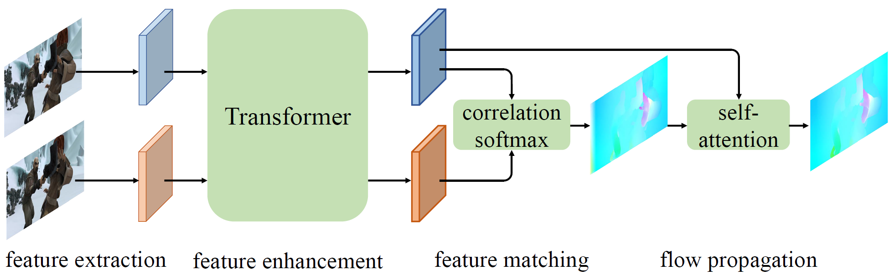
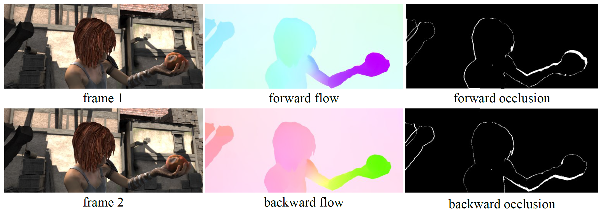

# GMFlow


Official PyTorch implementation of paper:

[**GMFlow: Learning Optical Flow via Global Matching**](https://arxiv.org/abs/2111.13680), **CVPR 2022, Oral**

Authors: [Haofei Xu](https://haofeixu.github.io/), [Jing Zhang](https://scholar.google.com.hk/citations?user=9jH5v74AAAAJ), [Jianfei Cai](https://jianfei-cai.github.io/), [Hamid Rezatofighi](https://scholar.google.com/citations?user=VxAuxMwAAAAJ), [Dacheng Tao](https://scholar.google.com/citations?user=RwlJNLcAAAAJ)


**11/15/2022 Update: Check out our new work: [Unifying Flow, Stereo and Depth Estimation](https://haofeixu.github.io/unimatch/) and code: [unimatch](https://github.com/autonomousvision/unimatch) for extending GMFlow to stereo and depth tasks. [More pretrained GMFlow models](https://github.com/autonomousvision/unimatch/blob/master/MODEL_ZOO.md) with different speed-accuracy trade-offs are also released. Check out our [Colab](https://colab.research.google.com/drive/1r5m-xVy3Kw60U-m5VB-aQ98oqqg_6cab?usp=sharing) and [HuggingFace](https://huggingface.co/spaces/haofeixu/unimatch) demo to play with GMFlow in your browser!**


**A [video introduction](https://www.bilibili.com/video/BV18A4y1R7PL) (in Chinese) of GMFlow is available at bilibili!**


https://user-images.githubusercontent.com/19343475/174446408-520b8a6c-9714-4ff3-978c-98e23ab29c1f.mp4


We streamline the optical flow estimation pipeline by reformulating optical flow as a **global matching** problem.


<p align="center"></p>


## Highlights

- **Flexible & Modular design**

  We decompose the end-to-end optical flow framework into five components:

  feature extraction, feature enhancement, feature matching, flow propagation and flow refinement.

  One can easily construct a customized optical flow model by combining different components.

- **High accuracy**

  With only one refinement, GMFlow outperforms 31-refinements RAFT on the challenging Sintel benchmark.

- **High efficiency**

  A basic GMFlow model (without refinement) runs at 57ms (V100) or 26ms (A100) for Sintel data (436x1024). 

  GMFlow gains more speedup than RAFT on high-end GPUs (e.g., A100) since GMFlow doesn't require a large number of sequential computation.

  GMFlow also simplifies backward flow computation without requiring to forward the network twice. The bidirectional flow can be used for occlusion detection with forward-backward consistency check.

  <p align="center"></p>

  


## Installation

Our code is based on pytorch 1.9.0, CUDA 10.2 and python 3.8. Higher version pytorch should also work well.

We recommend using [conda](https://www.anaconda.com/distribution/) for installation:

```
conda env create -f environment.yml
conda activate gmflow
```

## Demos

All pretrained models can be downloaded from [google drive](https://drive.google.com/file/d/1d5C5cgHIxWGsFR1vYs5XrQbbUiZl9TX2/view?usp=sharing).


You can run a trained model on a sequence of images and visualize the results:

```
CUDA_VISIBLE_DEVICES=0 python main.py \
--inference_dir demo/sintel_market_1 \
--output_path output/gmflow-norefine-sintel_market_1 \
--resume pretrained/gmflow_sintel-0c07dcb3.pth
```

You can also predict bidirectional flow with `--pred_bidir_flow` enabled and use `--fwd_bwd_consistency_check` for forward-backward consistency check. More examples can be found in [scripts/demo.sh](scripts/demo.sh).


## Datasets

The datasets used to train and evaluate GMFlow are as follows:

* [FlyingChairs](https://lmb.informatik.uni-freiburg.de/resources/datasets/FlyingChairs.en.html#flyingchairs)
* [FlyingThings3D](https://lmb.informatik.uni-freiburg.de/resources/datasets/SceneFlowDatasets.en.html)
* [Sintel](http://sintel.is.tue.mpg.de/)
* [KITTI](http://www.cvlibs.net/datasets/kitti/eval_scene_flow.php?benchmark=flow)
* [HD1K](http://hci-benchmark.iwr.uni-heidelberg.de/) 

By default the dataloader [datasets.py](data/datasets.py) assumes the datasets are located in folder `datasets` and are organized as follows:

```
datasets
├── FlyingChairs_release
│   └── data
├── FlyingThings3D
│   ├── frames_cleanpass
│   ├── frames_finalpass
│   └── optical_flow
├── HD1K
│   ├── hd1k_challenge
│   ├── hd1k_flow_gt
│   ├── hd1k_flow_uncertainty
│   └── hd1k_input
├── KITTI
│   ├── testing
│   └── training
├── Sintel
│   ├── test
│   └── training
```

It is recommended to symlink your dataset root to `datasets`:

```shell
ln -s $YOUR_DATASET_ROOT datasets
```

Otherwise, you may need to change the corresponding paths in [datasets.py](data/datasets.py).


## Evaluation

You can evaluate a trained GMFlow model by running:

```
CUDA_VISIBLE_DEVICES=0 python main.py --eval --val_dataset things sintel --resume pretrained/gmflow_things-e9887eda.pth 
```

More evaluation scripts can be found in [scripts/evaluate.sh](scripts/evaluate.sh).


For submission to Sintel and KITTI online test sets, you can run [scripts/submission.sh](scripts/submission.sh).


## Training

All training scripts on FlyingChairs, FlyingThings3D, Sintel and KITTI datasets can be found in [scripts/train_gmflow.sh](scripts/train_gmflow.sh) and [scripts/train_gmflow_with_refine.sh](scripts/train_gmflow_with_refine.sh).

Note that the basic GMFlow model (without refinement) can be trained on 4x 16GB V100 GPUs. For training GMFlow with refinement, 8x 16GB V100 or 4x 32GB V100 or 4x 40GB A100 GPUs are required by default. You may need to tune the batch size and training iterations according to your hardware. 


We support using tensorboard to monitor and visualize the training process. You can first start a tensorboard session with

```shell
tensorboard --logdir checkpoints
```

and then access [http://localhost:6006](http://localhost:6006) in your browser.


## Citation

If you find our work useful in your research, please consider citing our paper:

```
@inproceedings{xu2022gmflow,
  title={GMFlow: Learning Optical Flow via Global Matching},
  author={Xu, Haofei and Zhang, Jing and Cai, Jianfei and Rezatofighi, Hamid and Tao, Dacheng},
  booktitle={Proceedings of the IEEE/CVF Conference on Computer Vision and Pattern Recognition},
  pages={8121-8130},
  year={2022}
}
```


## Acknowledgements

This project would not have been possible without relying on some awesome repos : [RAFT](https://github.com/princeton-vl/RAFT), [LoFTR](https://github.com/zju3dv/LoFTR), [DETR](https://github.com/facebookresearch/detr), [Swin](https://github.com/microsoft/Swin-Transformer), [mmdetection](https://github.com/open-mmlab/mmdetection) and [Detectron2](https://github.com/facebookresearch/detectron2/blob/main/projects/TridentNet/tridentnet/trident_conv.py). We thank the original authors for their excellent work.


